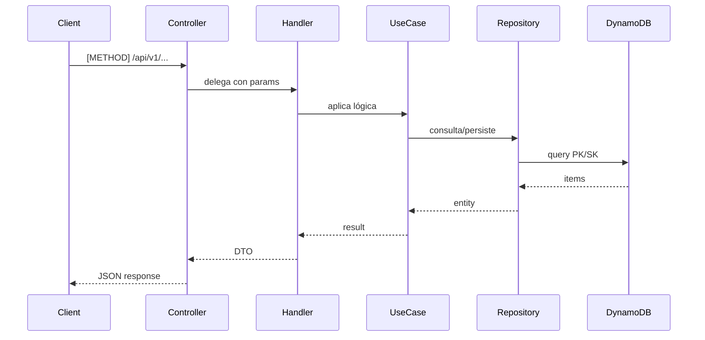

# [CÓDIGO] — Solución Técnica (Backend)

## Arquitectura

### Flujo de Datos



## Componentes por Capa

### Domain Layer

#### Entidad: [Nombre]
```java
/**
 * [Descripción de la entidad]
 */
public record [Nombre](
    String id,
    String tenantId,
    // ... campos
    Instant createdAt,
    Instant updatedAt
) {
    /**
     * Factory method para crear una nueva instancia.
     */
    public static [Nombre] create([Params]) {
        // Validaciones y creación
    }
}
```

#### Port: [NombreRepository]
```java
public interface [NombreRepository] {
    Optional<[Nombre]> findById(String tenantId, String id);
    Page<[Nombre]> findByTenant(String tenantId, [Filter] filter);
    void save([Nombre] entity);
    void delete(String tenantId, String id);
}
```

#### Use Case Interface: [NombreUseCase]
```java
@FunctionalInterface
public interface [NombreUseCase] {
    [ReturnType] apply([InputType] input);
}
```

### Application Layer

#### Use Case Impl: [NombreUseCaseImpl]
```java
@Singleton
public class [NombreUseCaseImpl] implements [NombreUseCase] {

    private final [NombreRepository] repository;

    @Inject
    public [NombreUseCaseImpl]([NombreRepository] repository) {
        this.repository = repository;
    }

    @Override
    public [ReturnType] apply([InputType] input) {
        // 1. Validar input
        // 2. Aplicar reglas de negocio
        // 3. Persistir
        // 4. Retornar resultado
    }
}
```

### Infrastructure Layer

#### DynamoDB Repository
```java
@Singleton
public class DynamoDb[Nombre]Repository implements [Nombre]Repository {

    private final DynamoDbTable<[Item]> table;

    @Inject
    public DynamoDb[Nombre]Repository(DynamoDbEnhancedClient client) {
        this.table = client.table("ProjectX", TableSchema.fromBean([Item].class));
    }

    @Override
    public Optional<[Nombre]> findById(String tenantId, String id) {
        var key = Key.builder()
            .partitionValue("TENANT#" + tenantId)
            .sortValue("[ENTITY]#" + id)
            .build();
        var item = table.getItem(key);
        return Optional.ofNullable(item).map(this::toDomain);
    }
}
```

#### DTOs
```java
public record [Nombre]RequestDto([campos]) {}
public record [Nombre]ResponseDto([campos]) {}
```

#### Mapper
```java
public class [Nombre]Mapper {
    public static [Nombre]ResponseDto toDto([Nombre] entity) { ... }
    public static [Nombre] toEntity([Nombre]RequestDto dto, String tenantId) { ... }
}
```

## DynamoDB Queries

| Operación | Tipo | PK | SK | Proyecciones |
|-----------|------|----|----|--------------|
| [op] | GetItem/Query | `TENANT#<id>` | `[ENTITY]#<id>` | [campos] |

## Validaciones

| Campo | Regla | Error |
|-------|-------|-------|
| [campo] | [regla] | [mensaje] |

## Testing

### Unit: [NombreUseCaseImplTest]
- `shouldDoXSuccessfully()` — Happy path
- `shouldThrowWhenY()` — Error case
- `shouldValidateZ()` — Validación

### Integration: [ControllerIntegrationTest]
- `shouldReturnXWhenGetY()` — Endpoint GET
- `shouldCreateXWhenPostY()` — Endpoint POST
- `shouldReturn404WhenNotFound()` — Not found

## Guice Bindings

```java
// En UseCaseModule
bind([NombreUseCase].class).to([NombreUseCaseImpl].class).in(Singleton.class);

// En InfraModule
bind([NombreRepository].class).to(DynamoDb[NombreRepository].class).in(Singleton.class);
```
